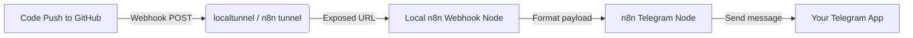

# 🤖 n8n GitHub to Telegram Bot Notifier

[](https://n8n.io)
[](https://telegram.org)
[](https://github.com)
[](https://opensource.org/licenses/MIT)

A self-hosted, lightweight automation setup using **n8n** to instantly forward GitHub commit notifications to your Telegram Bot. Includes automated database configurations to bypass n8n onboarding and pre-inject workflow credentials.

---

## 📋 Tags & Tech Stack
`#n8n` `#telegram-bot` `#github-webhooks` `#automation` `#self-hosted` `#devops` `#sqlite` `#nodejs`

---

## ⚙️ How It Works



1. **Commit & Push:** You push code changes to your GitHub repository.
2. **GitHub Webhook:** Triggers a webhook POST event containing commit details (repository, author, message, and URL).
3. **Secure Tunnel:** Exposes your local n8n instance safely to the web (using built-in tunnel or localtunnel).
4. **n8n Processing:** Parsed payload gets processed by n8n.
5. **Telegram Bot Dispatch:** Bot formats and sends the commit link and details directly to your Telegram chat.

---

## 🛠️ Configuration Details

- **Telegram Bot Token:** `YOUR_TELEGRAM_BOT_TOKEN`
- **Telegram Chat ID:** `YOUR_TELEGRAM_CHAT_ID`
- **Workflow ID:** `7ca64bb9-4e4b-4a5f-9e7c-87d4615a6b0c`

---

## 🚀 Quick Start Guide

### Step 1: Open the local n8n interface
### Step 2: Start n8n Local Server with a Tunnel
Run the helper PowerShell script:
```powershell
./start-n8n.ps1
```
Or start n8n manually with tunnel flags:
```bash
npx n8n start --tunnel
```
*Take note of the printed Tunnel URL in your console (e.g., `https://xxxx.hooks.n8n.cloud`).*

### Step 3: Configure GitHub Webhook
1. Go to your GitHub repository on github.com.
2. Click **Settings** -> **Webhooks** -> **Add webhook**.
3. In **Payload URL**, set the URL:
   ```text
   https://<your-tunnel-subdomain>.hooks.n8n.cloud/webhook/7ca64bb9-4e4b-4a5f-9e7c-87d4615a6b0c/webhook/github-commit
   ```
4. Set **Content type** to `application/json`.
5. Under "Which events would you like to trigger this webhook?", select **Just the push event** (default).
6. Click **Add webhook**.

---

## 📦 Project Structure
- `workflow.json` — Pre-configured n8n workflow definition with corrected `.body` expression mappings.
- `start-n8n.ps1` — Helper script to run the local server.
- `README.md` — Project documentation and setup guide.
